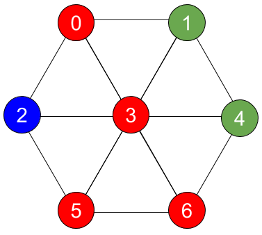

# Identically Connected Colored Components

## Question
Find identically-colored connected components in a triangle mesh with Open3D.

Implement a function to return a list of identically-colored connected components. An identically-colored connected 
component consists of spatially connected vertices with the same color. In this question, a connected component is 
represented by a list of vertex indices.

## Example Triangle Mesh


## Algorithm Used:
- Read the mesh.
- Calculate Triangle clusters using ClusterConnectedTriangles() function. 
Vertices in triangles having same cluster index are connected to each other.
- Find unique cluster indexes form above calculated clusters. Find unique colors of vertices colors.
- Initialize a 2D array of variable vectors, where no. of rows = size of unique cluster indexes and no. of coloumns = size of unique colors.
- Loop over the vertex indexs of triangles belonging to same cluster and check if the vertex color is identical to current unique color.  
  - If True, then check if the vertex is already present in the vector, if present, add the vertex index to the vector.
  - Else, continue.
- Sort the vectors ascendingly based on their length.

## How to Build
- The C++ function IdenticallyColoredConnectedComponents() with unit test and its Python Binding is integrated with [source code and Open3D build system](https://github.com/shashikant-ghangare/open3d/commit/3e1c7ccd12d8c7277900ca0720a55f1c879aa01d).
- Follow the instructions to build as documented at <http://www.open3d.org/docs/release/compilation.html>.

## Run Unit Test
Run unit tests by running the following command at `open3d/build/bin/`:
```bash
$ ./unitTests
```

## Run C++ Example solution.cpp and Python Example solution.py
- C++ Example [solution.cpp](https://github.com/shashikant-ghangare/open3d/blob/f6faf17393e08c5e46f3833837d950b25c58ae97/examples/Cpp/solution.cpp) is compiled while building Open3D.  

  It can be run at `open3d/build/bin/examples/` using:
  ```bash
  $ ./solution ../../../examples/TestData/test_mesh.ply 
  ```
  [results.txt](https://github.com/shashikant-ghangare/open3d/blob/f6faf17393e08c5e46f3833837d950b25c58ae97/examples/Cpp/results.txt) will be generated with formatted results.
- Python Example [solution.py](https://github.com/shashikant-ghangare/open3d/tree/f6faf17393e08c5e46f3833837d950b25c58ae97/examples/Python/Basic) at `open3d/examples/Python/Basic` can be run using:
  ```bash
  $ python3 solution.py 
  ```
   [results.txt](https://github.com/shashikant-ghangare/open3d/blob/f6faf17393e08c5e46f3833837d950b25c58ae97/examples/Python/Basic/results.txt) will be generated with formatted results.
  
